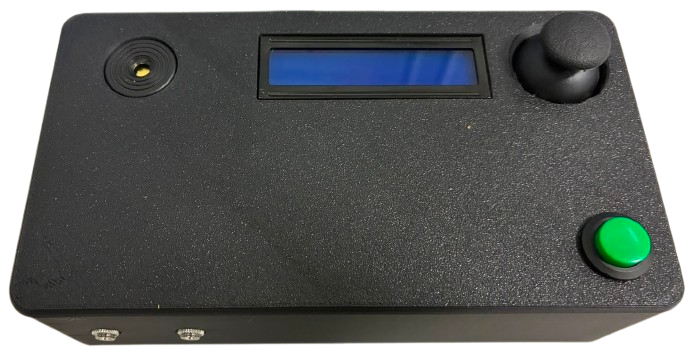

# CW Trainer

[Română](#română) · [English](#english)

  

---

## Română

**CW Trainer** este un antrenor de cod Morse pentru Arduino Nano (ATmega328P).
Folosește un LCD I²C 16×2 și un buzzer activ pentru demonstrarea semnalelor,
iar pentru operare oferă butonul Morse existent, un joystick KY-023, o intrare
pentru cheie simplă și o mufă TRS pentru paddle.

### Funcții actuale

- Meniu neblocant pentru alegerea exercițiului și reglarea vitezei între **5 și
  50 WPM** (implicit 15 WPM).
- Trei tipuri de exerciții: **Litere** (`A`–`Z`), **Cifre** (`0`–`9`) și
  **Fraze** (`CQ CQ`, `TEST ONE`, `HELLO WORLD`, `73 DE YO6LPG`).
- Redare Morse fără `delay()` pentru demonstrație și paddle, cu temporizare
  standard: punct `1200 / WPM`, linie 3 puncte, spațiu între elemente 1 punct,
  între litere 3 puncte și între cuvinte 7 puncte.
- Feedback pe LCD pentru răspuns: ținta (`T:`), următorul semnal între `[]`,
  `GRESIT! Incearca`, `CORECT!` și expirarea timpului. `/` separă literele,
  iar `//` separă cuvintele.
- Cheia originală de pe D7 pornește antrenamentul din meniul principal și
  introduce puncte/linii în timpul răspunsului. O apăsare sub două unități de
  timp este punct; una mai lungă este linie.
- Cheie simplă cu sidetone imediat și keyer simplu pentru paddle. Când DIT și
  DAH sunt apăsate simultan, următorul element alternează; modurile iambic A/B
  și memoria paddlelor nu sunt implementate.

### Componente

| Cantitate | Componentă | Observații |
| ---: | --- | --- |
| 1 | Arduino Nano compatibil, ATmega328P, USB-C | Alimentare și control. |
| 1 | LCD 1602 I²C | Adresa implicită este `0x27`; încearcă `0x3F` dacă nu răspunde. |
| 1 | Buzzer piezoelectric activ | Conectat la D8 și GND. |
| 1 | Buton momentan normal deschis | Cheia Morse originală, conectată la D7 și GND. |
| 1 | Joystick KY-023 | Navigare în meniu și selectare. |
| 1 | Jack pentru cheie simplă | Semnal la D3, masă la GND. |
| 1 | Jack TRS pentru paddle | Tip = DIT, Ring = DAH, Sleeve = GND. |
| – | Fire, carcasă și elemente de fixare | După necesități. |

Toate intrările de cheie folosesc `INPUT_PULLUP`; fiecare contact se leagă la
GND când este apăsat. Nu este necesară o rezistență externă de pull-up.

### Conexiuni

| Semnal | Pin Nano | Configurație |
| --- | --- | --- |
| LCD VCC / GND | 5V / GND | Masă comună. |
| LCD SDA / SCL | A4 / A5 | Magistrala I²C. |
| Buzzer activ | D8 / GND | Ieșire digitală. |
| Buton / cheie existentă | D7 / GND | `INPUT_PULLUP`, activ LOW. |
| KY-023 axa verticală / orizontală | A0 / A1 | Intrări ADC pe 10 biți. |
| KY-023 SW | D2 | `INPUT_PULLUP`, activ LOW. |
| Cheie simplă | D3 / GND | `INPUT_PULLUP`, activ LOW. |
| Paddle DIT (Tip) | D4 | `INPUT_PULLUP`, activ LOW. |
| Paddle DAH (Ring) | D5 | `INPUT_PULLUP`, activ LOW. |
| Paddle masă (Sleeve) | GND |  |

Pentru montajul calibrat, A0 este sus la valori `>700` și jos la `<300`, iar
A1 este dreapta la `>700` și stânga la `<300`. Direcțiile pot diferi de
etichetele VRx/VRy ale joystickului; pragurile sunt centralizate în schiță.
Alimentează KY-023 la 5 V numai cu acest Nano de 5 V. Pentru o placă cu ADC de
3,3 V, folosește niveluri sigure pentru intrări.

### Utilizare

1. La pornire, LCD-ul afișează `CW Trainer` și `YO6LPG` timp de două secunde.
2. În meniul principal, mișcă joystickul **stânga/dreapta** între `Training`,
   `Viteza WPM`, `Start Training` și `Inapoi`. Apăsarea scurtă a lui SW
   confirmă elementul selectat.
3. În `Training`, alege Litere, Cifre sau Fraze și apasă scurt SW pentru a
   salva. O apăsare lungă SW revine fără salvare.
4. În `Viteza WPM`, dreapta crește și stânga scade WPM; sus/jos nu schimbă
   viteza. O apăsare scurtă sau lungă SW revine în meniu.
5. Alege `Start Training` sau apasă butonul D7 din meniul principal. Dispozitivul
   afișează ținta, redă codul, apoi așteaptă răspunsul pe D7. Dacă răspunsul nu
   începe în 10 secunde, runda expiră; după rezultat, următoarea rundă pornește
   automat după trei secunde.
6. O apăsare lungă SW în timpul antrenamentului oprește runda și revine în
   meniul principal.

### Instalare și diagnosticare

1. Instalează [Arduino IDE](https://www.arduino.cc/en/software) și biblioteca
   **LiquidCrystal I2C** din Library Manager. `Wire` este inclusă în IDE.
2. Deschide `cw_trainer.ino`, selectează placa Arduino Nano și portul serial,
   apoi compilează și încarcă schița.
3. Pentru calibrarea joystickului, deschide Serial Monitor la **115200 baud**
   în ecranul `Viteza WPM`. Schița imprimă valorile A0/A1, direcția detectată
   și WPM înainte/după fiecare comandă. După calibrare, setează
   `JOYSTICK_DIAGNOSTICS` la `false` dacă nu mai dorești mesaje seriale.

### Depanare

- **LCD gol:** verifică alimentarea, contrastul și încearcă adresa `0x3F`.
- **Direcții inversate:** verifică valorile din Serial Monitor și ajustează
  pragurile sau corespondența axelor din `directionFromJoystick()`.
- **Paddle inversat:** inversează valorile `PIN_PADDLE_DIT` și
  `PIN_PADDLE_DAH`.
- **Fără sunet:** verifică polaritatea buzzerului activ și legăturile D8/GND.

---

## English

**CW Trainer** is an Arduino Nano (ATmega328P) Morse-code trainer. A 16×2 I²C
LCD and active buzzer demonstrate the signals; the existing Morse button,
KY-023 joystick, straight-key input, and TRS paddle input provide operation.

### Current features

- Non-blocking menu; speed is adjustable from **5 to 50 WPM** (15 WPM by
  default).
- **Letters** (`A`–`Z`), **Numbers** (`0`–`9`), and **Phrases** (`CQ CQ`,
  `TEST ONE`, `HELLO WORLD`, `73 DE YO6LPG`) training modes.
- Delay-free Morse playback for demonstrations and paddle output, using
  standard timing derived from `1200 / WPM`.
- LCD answer feedback, including target display, highlighted next element,
  correct/incorrect messages, and timeout. `/` marks letters and `//` words.
- D7 remains the original active-low Morse button: it starts training from the
  main menu and records dots/dashes during an answer.
- Straight-key sidetone and a simple non-iambic paddle keyer. Simultaneous DIT
  and DAH alternate the next element; paddle memory and iambic A/B are not yet
  implemented.

### Wiring and use

The hardware mapping is D8 buzzer, D7 existing key, A0/A1 joystick axes, D2
joystick switch, D3 straight key, D4 paddle DIT, and D5 paddle DAH. All key
inputs use `INPUT_PULLUP` and are active LOW; connect their other contact to
GND. LCD I²C uses A4/SDA and A5/SCL. The full wiring table and Romanian
step-by-step operating guide above are the canonical reference.

Install **LiquidCrystal I2C** through Arduino IDE's Library Manager, open
`cw_trainer.ino`, select the Arduino Nano and serial port, then compile and
upload. If the display does not respond at `0x27`, try `0x3F`. For joystick
calibration, use Serial Monitor at **115200 baud** in the WPM screen; set
`JOYSTICK_DIAGNOSTICS` to `false` once calibration is complete.
