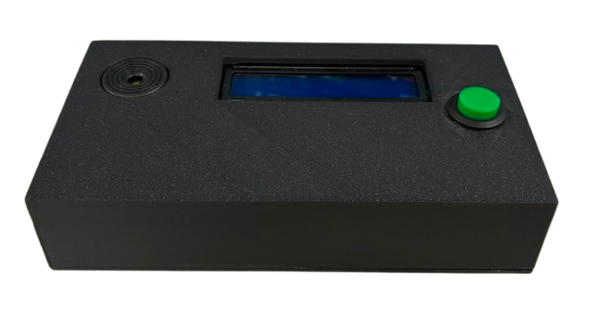
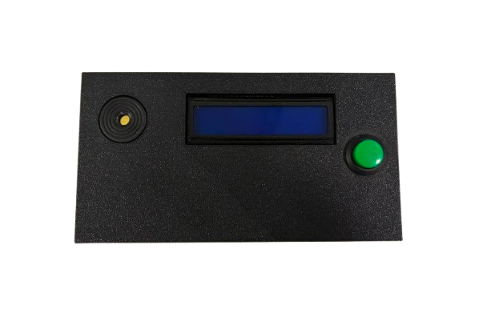

# CW Trainer

[Română](#română) · [English](#english)

---

<a id="română"></a>

## Română

Un dispozitiv de antrenament pentru codul Morse (CW), bazat pe Arduino Nano și
echipat cu USB-C. Schița selectează aleatoriu o literă sau o cifră pe care
utilizatorul trebuie să o reproducă prin apăsarea unui buton. LCD-ul și buzzerul
oferă feedback imediat.

<p align="center">
  
  
</p>

### Cum funcționează

1. La pornire, ecranul afișează `CW Trainer` pe primul rând și `YO6LPG` pe al
   doilea rând timp de două secunde, apoi afișează meniul principal.
2. După apăsare, dispozitivul alege un caracter dintre `A`–`Z` și `0`–`9`, îl afișează cu
   codul Morse pe LCD și redă ritmul prin buzzer.
3. Apasă cheia pentru a reproduce codul: o apăsare mai scurtă de două unități
   de timp este un punct, iar una mai lungă este o linie. În timpul răspunsului,
   LCD-ul arată ținta (`T:`), modelul Morse cu semnalele separate prin spații și
   încadrează în `[]` următorul punct sau următoarea linie care trebuie introdusă.
   În fraze, `/` separă literele și `//` separă cuvintele.
4. După fiecare semnal corect, evidențierea avansează. La un semnal greșit,
   LCD-ul afișează `GRESIT! Incearca`, păstrează semnalul curent și permite o
   nouă încercare; după întreaga secvență afișează `CORECT!`.

### Lista de componente

| Cantitate | Componentă | Specificații / observații |
| ---: | --- | --- |
| 1 | [Arduino Nano V3.0 compatibil cu USB-C](https://www.emag.ro/modul-nano-v3-0-cu-usb-c-compatibil-cu-arduino-arduino-nano-328-usbc/pd/DVW798MBM/) | Placă compatibilă Arduino Nano, cu ATmega328P și conector USB-C. |
| 1 | [LCD verde 1602 IIC/I²C](https://www.emag.ro/ecran-lcd-1602-iic-i2c-verde-ai849/pd/D9WQLTMBM/) | Afișaj I²C 16×2 compatibil cu `LiquidCrystal_I2C`; schița folosește implicit adresa `0x27`. |
| 1 | [Buzzer piezoelectric activ, 3–24 V HND-2312](https://www.emag.ro/buzzer-piezoelectric-activ-3-24v-hnd-2312-sjduen-buzzer-hnd-2312/pd/DSK1PD2BM/) | Se conectează la D8 și GND. Oscilatorul intern permite schiței să îl pornească și oprească pentru redarea ritmului Morse. |
| 1 | [Buton roșu momentan, normal deschis, F22 mm](https://www.emag.ro/buton-de-pornire-fara-blocare-no-rosu-f22mm-05718/pd/DJTBGF3BM/) | Se conectează între D7 și GND și servește drept cheie Morse. |
| 1 | Breadboard | Opțional, pentru prototipare. |
| 1 set | Fire jumper | Pentru toate conexiunile. |
| 6 | Șuruburi M3 × 6 mm | Pentru fixarea componentelor în carcasă. |
| 1 | Cablu USB-A–USB-C sau USB-C–USB-C | Pentru programarea și alimentarea plăcii Nano. |

Nu este necesară o rezistență de pull-up pentru cheie: schița activează
rezistența internă cu `INPUT_PULLUP`.

### Conexiuni

| Modul / semnal | Arduino Nano | Observații |
| --- | --- | --- |
| VCC LCD | 5V | Verifică tensiunea modulului LCD. |
| GND LCD | GND | Masă comună. |
| SDA LCD | A4 / SDA | Magistrala I²C. |
| SCL LCD | A5 / SCL | Magistrala I²C. |
| Buzzer `+` | D8 | Buzzer activ de 3–24 V, comutat digital pornit/oprit. |
| Buzzer `−` | GND |  |
| Un contact al butonului | D7 | Intrare configurată cu `INPUT_PULLUP`. |
| Celălalt contact al butonului | GND | O apăsare este citită ca `LOW`. |

Pe Nano, pinii I²C sunt A4/SDA și A5/SCL. Dacă LCD-ul nu afișează nimic,
verifică legăturile și încearcă `0x3F` în constructorul LCD din schiță.

### Instalare și încărcare

1. Instalează [Arduino IDE](https://www.arduino.cc/en/software).
2. Din Library Manager, instalează **LiquidCrystal I2C** (antetul
   `LiquidCrystal_I2C.h`). Biblioteca `Wire` este inclusă în Arduino IDE.
3. Deschide `cw_trainer.ino` în Arduino IDE.
4. Selectează placa și portul serial corecte din meniul **Tools**.
5. Compilează și încarcă schița.

### Configurare

Parametrii principali se află la începutul fișierului `cw_trainer.ino`:

| Parametru | Valoare implicită | Rol |
| --- | ---: | --- |
| `buzzerPin` | `8` | Pinul buzzerului. |
| `keyPin` | `7` | Pinul cheii Morse. |
| `wpm` | `15` | Viteza de antrenament; durata punctului se calculează ca `1200 / wpm`. |
| `answerTimeout` | `10000` ms | Timpul maxim permis pentru începerea răspunsului. |

### Setul de exerciții

Fiecare rundă poate utiliza unul dintre aceste **36 de caractere**:

- literele `A`–`Z`;
- cifrele `0`–`9`.

Selecția aleatorie utilizează automat dimensiunea setului de caractere definit
în schiță, astfel încât fiecare literă și cifră are șanse egale să apară.
Cifrele folosesc codurile Morse internaționale din cinci simboluri: de exemplu,
`0` este `-----`, `5` este `.....`, iar `9` este `----.`.

### De făcut

- Adăugarea funcției de meniu și a butoanelor necesare pentru navigarea în meniu.
- Adăugarea a două mufe jack pentru o cheie simplă și o cheie automată tip paddle.
- Refacerea modelului 3D.

### Depanare

- **LCD gol:** reglează potențiometrul de contrast al modulului și încearcă
  adresa `0x3F` în loc de `0x27`.
- **Butonul funcționează invers:** confirmă că este conectat între D7 și GND,
  nu la 5V.
- **Buzzer fără sunet:** verifică polaritatea (`+` la D8 și `−` la GND) și că
  modelul este activ, cu oscilator intern.

---

<a id="english"></a>

## English

An Arduino Nano–based Morse code (CW) trainer with USB-C. The sketch randomly
selects a letter or digit for the user to reproduce with a button, while the LCD
and buzzer provide immediate feedback.

<p align="center">
  
  
</p>

## How it works

1. At startup, the display shows `CW Trainer` on the first line and `YO6LPG`
   on the second line for two seconds, then shows the main menu.
2. After the press, the device randomly selects a character from `A`–`Z` and `0`–`9`, displays
   the character and its Morse code on the LCD, and plays its rhythm through the
   buzzer.
3. Press the key to reproduce the code you heard:
   - a press shorter than two time units is a dot;
   - a longer press is a dash;
   - while answering, the LCD shows the target (`T:`), spaces between Morse
     signals, and wraps the next required signal in `[]`. In phrases, `/`
     separates letters and `//` separates words.
4. Each correct signal advances the highlight. A wrong signal shows
   `GRESIT! Incearca`, keeps the current signal highlighted, and can be retried;
   completing the full sequence shows `CORECT!`.

## Bill of materials

| Quantity | Component | Specification / notes |
| ---: | --- | --- |
| 1 | [Arduino Nano V3.0 compatible, USB-C](https://www.emag.ro/modul-nano-v3-0-cu-usb-c-compatibil-cu-arduino-arduino-nano-328-usbc/pd/DVW798MBM/) | Arduino Nano-compatible board with an ATmega328P and USB-C connector. |
| 1 | [Green LCD 1602 IIC/I²C](https://www.emag.ro/ecran-lcd-1602-iic-i2c-verde-ai849/pd/D9WQLTMBM/) | 16×2 I²C display compatible with `LiquidCrystal_I2C`; the sketch uses `0x27` as its default address. |
| 1 | [Active piezo buzzer, 3–24 V HND-2312](https://www.emag.ro/buzzer-piezoelectric-activ-3-24v-hnd-2312-sjduen-buzzer-hnd-2312/pd/DSK1PD2BM/) | Connects to D8 and GND. Its internal oscillator lets the sketch turn it on and off to play the Morse rhythm. |
| 1 | [Momentary, normally open red button, F22 mm](https://www.emag.ro/buton-de-pornire-fara-blocare-no-rosu-f22mm-05718/pd/DJTBGF3BM/) | Connects between D7 and GND and serves as the Morse key. |
| 1 | Breadboard | Optional, for prototyping. |
| 1 set | Jumper wires | For all connections. |
| 6 | M3 × 6 mm screws | For securing components in the enclosure. |
| 1 | USB-A–to–USB-C or USB-C–to–USB-C cable | For programming and powering the Nano board. |

No pull-up resistor is required for the key: the sketch enables the internal
resistor with `INPUT_PULLUP`.

## Connections

| Module / signal | Arduino Nano | Notes |
| --- | --- | --- |
| LCD VCC | 5V | Check the LCD module voltage. |
| LCD GND | GND | Common ground. |
| LCD SDA | A4 / SDA | I²C bus. |
| LCD SCL | A5 / SCL | I²C bus. |
| Buzzer `+` | D8 | Active 3–24 V buzzer; switched digitally on and off. |
| Buzzer `−` | GND |  |
| One button contact | D7 | Input configured with `INPUT_PULLUP`. |
| Other button contact | GND | A press is read as `LOW`. |

On the Nano, the I²C pins are A4/SDA and A5/SCL. If the LCD displays nothing,
check the wiring and try `0x3F` in the sketch's LCD constructor.

## Installation and upload

1. Install the [Arduino IDE](https://www.arduino.cc/en/software).
2. Use the Library Manager to install **LiquidCrystal I2C** (the
   `LiquidCrystal_I2C.h` header). The `Wire` library is included with Arduino IDE.
3. Open `cw_trainer.ino` in Arduino IDE.
4. Select the correct board and serial port from the **Tools** menu.
5. Compile and upload the sketch.

## Configuration

The main parameters are at the beginning of `cw_trainer.ino`:

| Parameter | Default value | Purpose |
| --- | ---: | --- |
| `buzzerPin` | `8` | Buzzer pin. |
| `keyPin` | `7` | Morse key pin. |
| `wpm` | `15` | Training speed; dot duration is calculated as `1200 / wpm`. |
| `answerTimeout` | `10000` ms | Maximum time allowed to start the response. |

### Exercise set

Each round can use one of these **36 characters**:

- letters `A`–`Z`;
- digits `0`–`9`.

Random selection automatically uses the size of the character set defined in
the sketch, giving every letter and digit an equal chance of appearing. Digits
use the five-symbol International Morse codes: for example, `0` is `-----`,
`5` is `.....`, and `9` is `----.`.

### To-do

- Redesign the 3D model.

### Menu, keys, and wiring (implemented)

The sketch now runs a non-blocking menu and Morse-output state machine. The
existing **D7** button remains the original active-low Morse input: it starts
training from the main menu and, while a character answer is requested, its
press duration is decoded exactly as the original dot/dash key. It is not
shared with any new connector.

| Signal | Arduino Nano pin | Configuration |
| --- | --- | --- |
| Existing button/key | D7 | `INPUT_PULLUP`, active LOW (unchanged) |
| Active buzzer | D8 | Output (unchanged) |
| KY-023 VRx / VRy | A0 / A1 | 10-bit ADC inputs |
| KY-023 SW | D2 | `INPUT_PULLUP`, active LOW |
| Straight-key jack signal | D3 | `INPUT_PULLUP`, active LOW |
| Paddle TRS Tip (DIT) | D4 | `INPUT_PULLUP`, active LOW |
| Paddle TRS Ring (DAH) | D5 | `INPUT_PULLUP`, active LOW |
| LCD I2C | A4/SDA, A5/SCL | reserved for LCD |

Connections:

```text
KY-023 GND -> Nano GND
KY-023 VCC -> Nano 5V
KY-023 VRx -> A0
KY-023 VRy -> A1
KY-023 SW  -> D2

Straight-key jack signal -> D3
Straight-key jack ground -> GND

Paddle TRS Tip    -> D4 (DIT)
Paddle TRS Ring   -> D5 (DAH)
Paddle TRS Sleeve -> GND

Existing button remains: D7 -> button -> GND
```

This mapping is specific to the documented 5 V Arduino Nano/ATmega328P. Power
the KY-023 from 5 V on this board; do **not** use that recommendation on a
3.3 V ADC board unless the joystick output is level-shifted or powered at a
safe voltage. Some paddles reverse Tip/Ring; swap `PIN_PADDLE_DIT` and
`PIN_PADDLE_DAH` in the centralized configuration if necessary.

Use the joystick up/down to move, left/right to adjust, short press to select,
and hold SW for 800 ms to return/stop training. The 10-bit ADC thresholds,
repeat timing, WPM range (5--50), and all pin assignments are centralized at
the beginning of `cw_trainer.ino`. DIT and DAH held together alternate the next
element; this deliberately documented simple alternation is not yet iambic A/B
and is isolated so paddle memory/iambic modes can be added later.

#### Hardware regression checklist

1. Verify neutral joystick gives no menu movement; test up/down, held repeat,
   left/right WPM adjustment, short select, and long return at both WPM limits.
2. Select Letters, Numbers, and Phrases; start and long-press SW to stop.
3. From the menu and during an answer, press and hold the original D7 button:
   it must still start training, sound while held, and classify short/long
   presses as dot/dash without interaction from the joystick or jacks.
4. Test straight key press/release/hold for immediate sidetone. Test DIT, DAH,
   each held, and both together; changing WPM must change their element length.
5. Confirm LCD, buzzer, and I2C wiring remain functional before enclosing the
   device.

## Troubleshooting

- **Blank LCD:** adjust the module contrast potentiometer and try address
  `0x3F` instead of `0x27`.
- **Button behaves in reverse:** confirm that it is wired between D7 and GND,
  not 5V.
- **No buzzer sound:** check the polarity (`+` to D8 and `−` to GND) and verify
  that the model is active with an internal oscillator.
